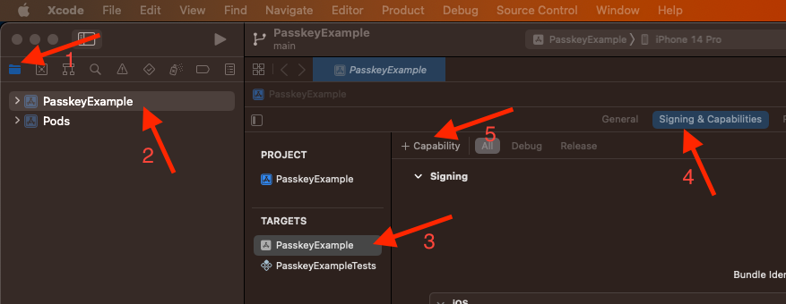
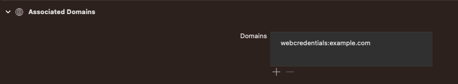

# rn-passkey

rn-passkey is an implementation of passkeys for react native.

Passkeys is an alternative method of user authentication that eliminates the need for a password while being easier to use and far more secure.<br>
Correctly implemented it improves the user experience.

## Installation
###### Install the library using either npm:
```sh
npm install rn-passkey
```
###### or yarn:
```sh
yarn add rn-passkey
```
Then install the native dependencies:
``` sh
cd ios && pod install
```
### Android

### iOS
On iOS the system should be able to verify the domain associated with your app.
To do this, you need to:
##### - Add an associated domains file to your website ([apple doc](https://developer.apple.com/documentation/xcode/supporting-associated-domains)).
Construct a JSON file named apple-app-site-association (without an extension) and place it in your site's .well-known directory at the root of your domain.

For example, if your domain is 'example.com':<br>
the file should be located at https://example.com/.well-known/apple-app-site-association. <br>
and it should contain a JSON object with the following structure:
```json
{
  "webcredentials": {
    "apps": [ "ABCDE12345.com.example.app" ]
  }
}
```
in which:<br>
`ABCDE12345` is your Team ID ([locate your Team ID](https://developer.apple.com/help/account/manage-your-team/locate-your-team-id))<br>
and<br>
`com.example.app` is your app's bundle identifier.

##### - Add the domain to the `Associated Domains` capability in your app's entitlements file ([apple doc](https://developer.apple.com/documentation/bundleresources/entitlements/com_apple_developer_associated-domains)).
To add your domain to the entitlement, you need to
- open your app with Xcode,<br>
- select your app target (_step 1, 2 , and 3 on the screenshot below_),<br>
- go to the Signing & Capabilities tab (_step 4_),<br>
- click (+ Capability) to add the 'Associated Domains' capability (_step 5_),<br>
<br>
- click the (+) button to add a placeholder domain.<br>
Replace it with webcredentials:<yourdomain.com>,<br>
It should look like this:<br>
<br>
While you're developing your app, for debugging purposes or if your server is unreachable from the public internet, you can use the alternate mode feature ([apple doc](https://developer.apple.com/documentation/bundleresources/entitlements/com_apple_developer_associated-domains)).<br>
For example like this: webcredentials:example.com?mode=developer,<br>

## Usage

```ts
import { multiply } from 'rn-passkey';

// ...

const result = await multiply(3, 7);
```

## Contributing

See the [contributing guide](CONTRIBUTING.md) to learn how to contribute to the repository and the development workflow.

## License

MIT

---

Made with [create-react-native-library](https://github.com/callstack/react-native-builder-bob)
